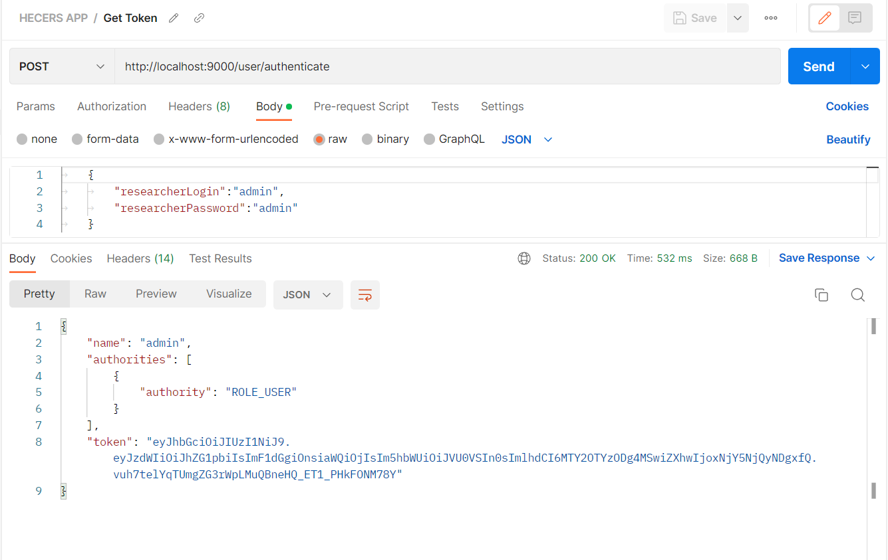
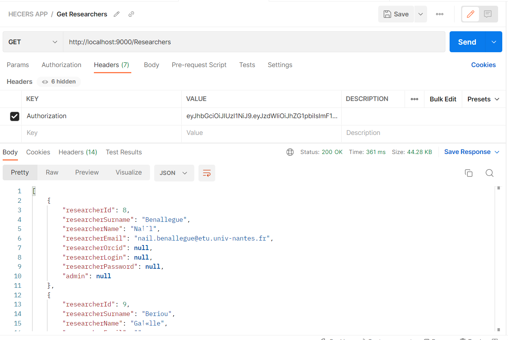

[Liste de tous les doc](../README.md)

# Postman

Ce readme vise à utiliser Postman avec le projet HECERS pour tester l'API backend sans avoir besoin d'une
interface graphique.

## Tableau de contenu

<!-- TOC -->

* [Postman](#postman)
    * [Telchargement](#telchargement)
    * [Import de configuration](#import-de-configuration)
* [Generation du token de connection](#generation-du-token-de-connection)
* [Example d'accès au api](#example-daccs-au-api)
* [Ajout Automatique du token](#ajout-automatique-du-token)
    * [Etape 1](#etape-1)
    * [Etape 2](#etape-2)
    * [Etape 3](#etape-3)

<!-- TOC -->

## Telchargement

[ Telecharger Postman ](https://www.postman.com/downloads/)

## Import de configuration

* Importer le fichier [HECERS APP.postman_collection.json](HECERS%20APP.postman_collection.json) dans postman
* Adapter le researcherLogin/researcherPassword comme votre database (admin/admin sont utilises par default)
* S'assurer que hecres spring boot est bien lancé
* Tester les different requêtes dans la collection ou bien entrer le votre !
* pour plus d'explication suivre cette read me

# Generation du token de connection

* Creer une nouvelle collection, Ex.: **HECERS API**
* Ajouter une request sous le nom de **Get Token**

| Input  | Value                                   |
|--------|-----------------------------------------|
| Method | POST                                    |
| URL    | http://localhost:9000/user/authenticate |
| Body   | raw => Json                             |

Example du json pour copier/coller :

```json
{
  "researcherLogin": "admin",
  "researcherPassword": "admin"
}
```

Résultat Attendu :


# Example d'accès au api

* Ajouter une request sous le nom de **Get Researchers**

| Input  | Value                                   |
|--------|-----------------------------------------|
| Method | GET                                     |
| URL    | http://localhost:9000/Researchers       |
| Header | Key: **Authorization** Value: **Token** |

ToKen est la valeur du token genere par la partie [Get Token](#generation-du-token-de-connection)

Résultat Attendu :


# Ajout Automatique du token

* Cliquer sur la Collection du projet
* Onglet **Variable** : ajouter une variable sous le nom de **tokenEnv**
* Onglet **Pre-request** : Copier coller le script ci-dessous dedans
* Onglet **Authorization** :
    - Type = API Key
    - Key = Authorization
    - Value = {{tokenEnv}}
* Voila ! vous pouvez maintenat faire de requetes sans besoin d'ajouter de token dans cette collection

```javascript
// request pour gerener le token
const postRequest = {
    url: 'http://localhost:9000/user/authenticate',
    method: 'POST',
    header: {
        'Content-Type': 'application/json',
        'X-Foo': 'bar'
    },
    body: {
        mode: 'raw',
        raw: JSON.stringify({researcherLogin: 'admin', researcherPassword: 'admin'})
    }
};
// lancer la requete et sauvegarder la valeur du token dans le variable d'environnment
pm.sendRequest(postRequest, (error, response) => {
    pm.collectionVariables.set('tokenEnv', response.json()['token']);
});
```

Résultat Attendu :

## Etape 1


## Etape 2


## Etape 3


